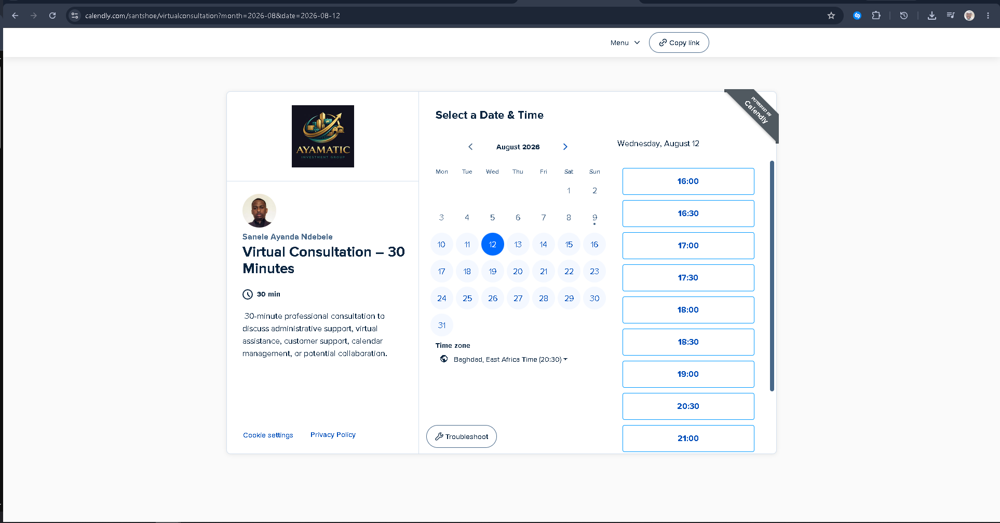

# 📅 Calendar & Meeting Management Portfolio

## 👋 Overview

Welcome to my **Calendar & Meeting Management Portfolio**.

This project demonstrates my practical ability to organize schedules, manage appointments, coordinate meetings, track tasks, and maintain an efficient administrative workflow using digital calendar and productivity tools.

The portfolio was created to demonstrate the skills required in **Virtual Assistant, Executive Assistant, Administrative Support, Customer Support, and Remote Operations** roles.

---

## 🎯 Project Objective

The objective of this project is to demonstrate how I can manage a professional calendar and scheduling workflow while maintaining organization, accuracy, and effective time management.

The project focuses on:

- Calendar management
- Appointment scheduling
- Meeting coordination
- Time management
- Task organization
- Client information management
- Productivity tracking
- Remote meeting coordination
- Administrative organization

---

## 🛠️ Tools & Technologies

### Calendar & Scheduling

- Google Calendar
- Calendly

### Online Meetings

- Zoom
- Google Meet

### Productivity & Organization

- Microsoft Excel
- Google Sheets
- Daily Planner
- Weekly Planner
- Monthly Planner

---

# 📅 Calendly Scheduling System

I created a live Calendly scheduling page to demonstrate how I would manage professional appointments and consultations.

### 🔗 Live Booking Page

👉 [Book a Virtual Consultation](https://calendly.com/santshoe/virtualconsultation)

The booking system is configured to demonstrate:

- 30-minute appointments
- Calendar availability management
- 10-minute buffer before meetings
- 10-minute buffer after meetings
- Maximum of 10 meetings per day
- Invitee name collection
- Email collection
- Phone number collection where applicable
- Custom invitee questions
- Booking confirmation emails
- Cancellation management
- Post-booking confirmation page
- Zoom integration
- Google Meet integration
- Time-zone-aware scheduling

### Calendly Booking Page

---

# 📆 Google Calendar Management

Google Calendar is used to organize appointments, meetings, tasks, and scheduled commitments.

The calendar workflow demonstrates my ability to:

- Schedule meetings
- Organize appointments
- Manage recurring commitments
- Monitor availability
- Avoid scheduling conflicts
- Coordinate meetings across different times
- Maintain an organized daily schedule

### Google Calendar Example

---

# 📊 Appointment Tracker

The Appointment Tracker is designed to maintain an organized record of scheduled appointments.

It can be used to track:

- Appointment date
- Appointment time
- Client/invitee
- Meeting type
- Meeting platform
- Status
- Follow-up requirements
- Notes

**Purpose:**  
To ensure appointments are properly recorded and follow-ups are not missed.

---

# 📝 Daily Planner

The Daily Planner is used to organize daily priorities and responsibilities.

It helps with:

- Prioritizing tasks
- Scheduling activities
- Tracking completed tasks
- Managing deadlines
- Organizing meetings
- Maintaining daily productivity

---

# 📅 Weekly Planner

The Weekly Planner provides a broader overview of appointments, tasks, and priorities throughout the week.

It helps identify:

- Upcoming meetings
- Important deadlines
- High-priority tasks
- Available working time
- Recurring responsibilities

---

# 📆 Monthly Planner

The Monthly Planner provides a high-level view of important commitments and activities.

It can be used to:

- Plan ahead
- Identify busy periods
- Schedule important events
- Track deadlines
- Balance meetings and tasks

---

# 📈 Productivity Tracker

The Productivity Tracker is designed to monitor productivity and task completion.

It can be used to evaluate:

- Tasks completed
- Tasks outstanding
- Productivity levels
- Time management
- Daily and weekly performance

### Productivity Score

The productivity score can be calculated as:

**Productivity Score (%) = Completed Tasks ÷ Total Tasks × 100**

For example:

If 18 out of 20 tasks are completed:

**18 ÷ 20 × 100 = 90%**

---

# 🔄 Calendar Management Workflow

The project demonstrates the following workflow:

**Client / Invitee**

↓

**Calendly Booking Page**

↓

**Select Date & Time**

↓

**Invitee Information & Questions**

↓

**Appointment Confirmation**

↓

**Google Calendar**

↓

**Zoom / Google Meet**

↓

**Confirmation Email**

↓

**Meeting**

↓

**Follow-Up / Task Tracking**

---

# 💼 Skills Demonstrated

This portfolio demonstrates practical experience with:

### Administrative Support

- Calendar management
- Appointment scheduling
- Meeting coordination
- Task management
- Document organization
- Information management
- Follow-up tracking
- Time management

### Executive Assistant Skills

- Managing competing priorities
- Protecting calendar availability
- Scheduling meetings
- Coordinating appointments
- Managing recurring commitments
- Preventing scheduling conflicts
- Organizing information

### Communication

- Professional email communication
- Client communication
- Meeting coordination
- Appointment confirmations
- Cancellation communication

### Technical Skills

- Google Calendar
- Calendly
- Zoom
- Google Meet
- Microsoft Excel
- Google Sheets

---

# 📂 Project Files

| File | Purpose |
|------|---------|
| `Appointment Tracker.xlsx` | Tracks appointments and meeting details |
| `Daily Planner.xlsx` | Organizes daily tasks and priorities |
| `Weekly Planner.xlsx` | Organizes weekly commitments |
| `Monthly Planner.xlsx` | Provides monthly schedule planning |
| `Productivity Tracker.xlsx` | Tracks productivity and task completion |
| `Calendar & Schedule Management.xlsx` | Supports calendar and schedule organization |
| `Google calendar.png` | Example of calendar management |
| `calendly-booking-page.png` | Example of the live scheduling system |

---

# 🎯 Professional Application

This project was developed as a practical demonstration of my ability to support:

- Executives
- Managers
- Entrepreneurs
- Remote teams
- Clients
- Customers

I understand that effective calendar management is more than simply adding meetings to a calendar. It requires **planning, prioritization, attention to detail, communication, time management, and follow-through**.

---

# 👨‍💼 About Me

I am a hospitality and administrative professional with experience managing teams, customers, schedules, daily operations, and multiple priorities in fast-paced environments.

I am developing my career toward **Virtual Assistance, Executive Assistance, Administrative Support, Customer Support, and Remote Operations**.

I am particularly interested in helping professionals and businesses stay organized, manage their time effectively, and maintain smooth day-to-day operations.

---

# 📫 Connect With Me

**LinkedIn:**  
[Connect with me on LinkedIn](YOUR_LINKEDIN_LINK)

**GitHub:**  
[View my GitHub Profile](https://github.com/Santshoe)

**Calendly:**  
[Book a Virtual Consultation](https://calendly.com/santshoe/virtualconsultation)

---

## ⭐ Project Purpose

This repository is part of my professional portfolio and demonstrates my commitment to continuous learning, digital organization, and developing practical skills for remote administrative and executive support roles.
